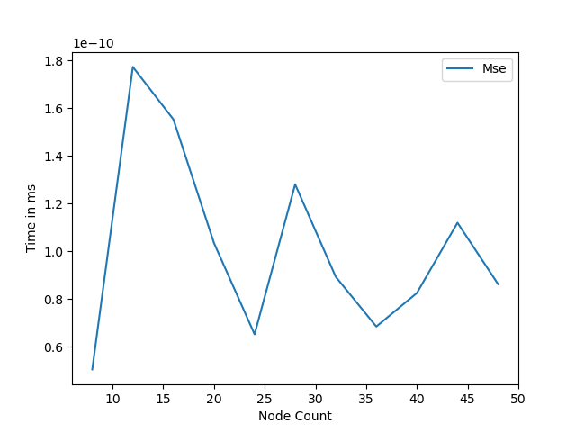
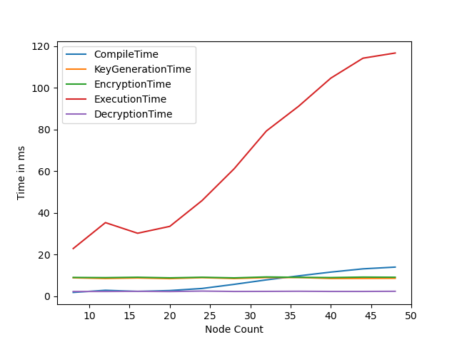
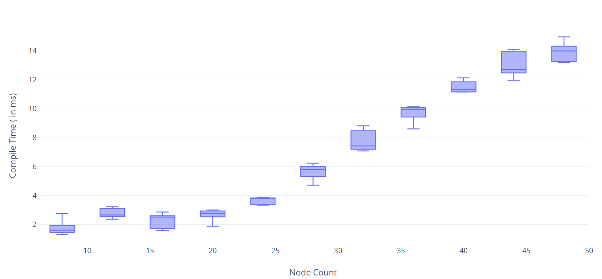
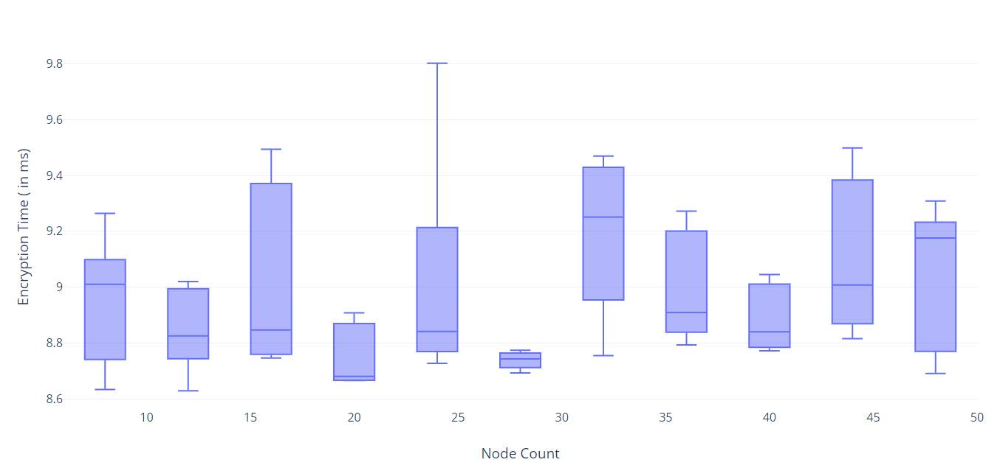
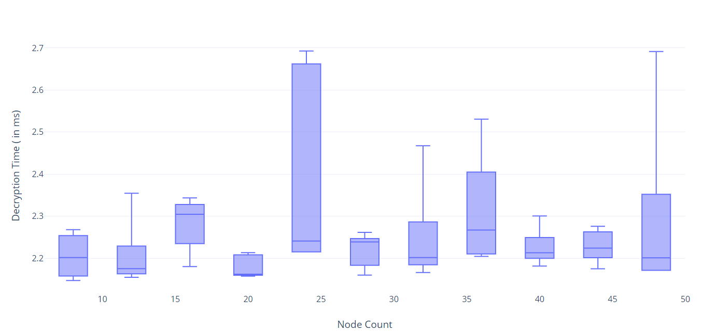
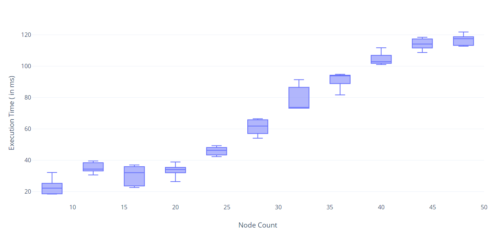
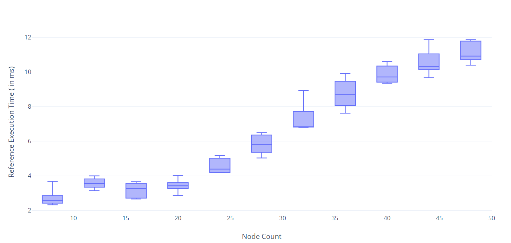
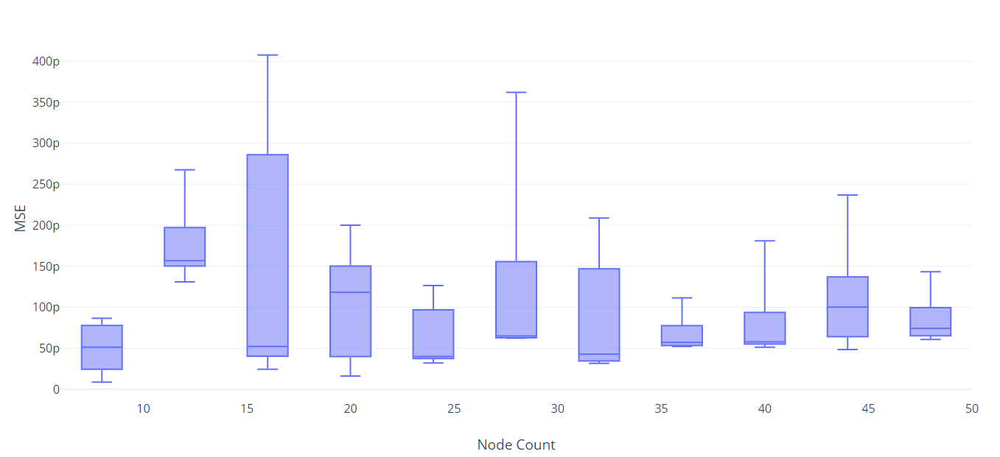

# HomomorphicEncryptionProject
Ceng 519 homomorphic encryption using Microsoft SEAL and EVA

Homomorphic encryption is a type of encryption that allows users to
compute on encrypted material without having to first decode it. In this
work, we aimed to implement breadth-first search on an encrypted graph.
Experiments have been done with several graph sizes with different
parameters. Comparison of these results states that our approach is
reasonable and performs expediently according to the behavior on the
algorithm on the non-encrypted data.

Introduction
============

In this study, our problem is to get the result we want by performing
only mathematical operations on the data that we cannot decrypt. The
environment we use allows only four modes of operation and bitwise shift
operations. Using these features, we aim to apply graph algorithm of our
choice namely BFS on an encrypted data and get the results properly when
we decrypt.

Encryption techniques are meant to break any links between plaintext and
the ciphertext it corresponds to. The ciphertext produced by an
encryption algorithm cannot be distinguished from a arbitrary integer.
The only method to figure out which plaintext matches to which
ciphertext is to decrypt it with the right key. The interesting thing at
this point is that there must be a relationship between plaintexts and
ciphertexts in order to execute mathematical operations on encrypted
data. It must be feasible to add or multiply two ciphertexts and achieve
the same result as doing the same operation on the two plaintexts and
then encrypting the result. Besides, while preserving this relationship,
it should be hidden from outside to prevent possible reverse engineering
scenarios. This type of encryption and being able to operate on data
provides great opportunities to analyze and use sensitive information in
different domains such as health records, finance or elections.

There are several libraries to implement homomorphic encryption and
several schemes that each allows certain operations on data. The most
challenging part in homomorphic encryption is the comparison operation.
By definition, it is not possible to check the value after applying
mathematical operations. Hence, branching according to the results is
not possible in the program.

BFS Algorithm
-------------

Breadth-first Search is a widely used algorithm for trees and graphs.
BFS technique is used to search a tree data structure for a node that
meets a set of criteria. It begins at the root of the tree and
investigates all nodes at the current depth level before moving on to
nodes at the next depth level. To maintain track of the child nodes that
have been encountered but not yet visited, more memory, generally a
queue, is required.

Background and Related Work
===========================

Background
----------

Companies deal with a lot of sensitive data on a daily basis, such as
personally identifiable information or financial data, which must be
encrypted storing and transferring. Because they need too much
processing power to break, modern encryption methods are almost
unbreakable. In other words, breaking them is too expensive and
time-consuming.

A homomorphic cryptosystem is similar to other types of public
encryption in that it encrypts data with a public key and only enables
the person with the matching private key to view the decrypted data. The
fact that it employs an algebraic framework to let you or others to do a
range of computations (or operations) on the encrypted data sets it
distinct from other types of encryption.

Homomorphic encryption may be divided into three categories. The most
significant distinction between them is the types and frequency of
mathematical operations that may be performed on the ciphertext. Three
types are partially, somewhat, and fully homomorphic encryption. A few
mathematical functions (addition or multiplication) can be done on
encrypted data with partially homomorphic encryption. A somewhat
homomorphic encryption system, allows for addition or multiplication up
to a particular level of complexity, and with limited times.

While still in its early stages of development, fully homomorphic
encryption shows a lot of promise for balancing functionality and
privacy by allowing information to be both safe and accessible at the
same time. FHE is a secure multi-party computing technique that was
developed from the SHE scheme. It can use both addition and
multiplication any number of times and makes safe multi-party
computation more efficient. It can handle arbitrary calculations on your
ciphertexts, unlike other kinds of homomorphic encryption.

Available libraries and tools for implementing homomorphic encryption is
discussed in the following section.

### Mechanism

Related Work
------------

This section is divided into three parts. First, evolution of fully
homomorphic encryption is discussed. In the latter part, promising
homomorphic encryption libraries and toolkits are considered. Last
part’s main focus is the platform called SEAL and EVA wrapper used in
the project.

### Evolution of Fully Homomorphic Encryption

Fully homomorphic encryption took its current form as a result of a long
research process.

Gentry’s architecture enables both addition and multiplication
operations on encrypted texts, allowing circuits to conduct arbitrary
computations to be built from them. The building process is broken down
into many parts, each of which introduces and subsequently reduces
noise. This allows you to calculate any amount of adds and
multiplications without significantly increasing the noise.[1]

The present homomorphic cryptosystems are based on approaches developed
by Zvika Brakerski, Craig Gentry, Vinod Vaikuntanathan, and others
between 2011 and 2012 3. These breakthroughs paved the way for the
creation of significantly more efficient, partially and entirely
homomorphic cryptosystems. These systems are called second generation
FHE’s which build a partially homomorphic cryptosystem initially, then
use bootstrapping to transform it to a completely homomorphic
cryptosystem. They are efficient but slow. [2]

Craig Gentry, Amit Sahai, and Brent Waters (GSW) introduced a novel
method for constructing FHE schemes that avoids the costly
“relinearization” phase in homomorphic multiplications in 2013.
[3] This phase is marked as the 3rd generation FHE’s. The third
generation of FHE has seen significant improvements in efficiency. The
TFHE scheme expanded on the FHEW method, which lowered bootstrapping
time to a fraction of a second.

The fourth generation of FHE is now in the works. This is primarily
concerned with practical applications and increasing the scope of use.
The CKKS method makes encrypted rounding efficient. [4] The
rounding operation reduces the number of steps in a circuit by
controlling the growth of noise in coded multiplication.

### Homomorphic Encryption Libraries

There exists various libraries. A Fully Homomorphic Encryption library
(FHEW) supports the homomorphic evaluation of arbitrary boolean circuits
on encrypted data using a public (evaluation) key, and offers a
symmetric encryption mechanism to encrypt (and decode) single bit
messages. However, it is not maintained library.

Another widely-used alternative is PALISADE, which is an open source
library from a group of DARPA-funded defense contractors that supports
numerous homomorphic encryption algorithms with multiparty support,
including BGV, BFV, CKKS, TFHE, and FHEW.

Moreover, homomorphic encryption is also used for deep learning layer
implementations. For this reason, cuHE is emerged to investigate how
GPUs can be used to speed up homomorphic encryption.

IBM’s library HElib is an option which supports both BGV and CKKS
schemes. Last but not the least, SEAL from Microsoft is one of the most
up-to-date and maintained libraries among all. It also supports the BFV
and CKKS schemes.

### Microsoft SEAL and EVA

The Cryptography and Privacy Research Group at Microsoft developed
Microsoft SEAL. It’s an open-source homomorphic encryption library
written in modern C++. Both asymmetric and symmetric encryption
techniques are supported by Microsoft SEAL.

In order to provide high level API, Microsoft designed another wrapper
that takes SEAL and provides high level functions. It is available for
python language with the package PyEVA.

Main Contributions
==================

This section is divided into three parts. In the first part,
implementation of Breadth-First Search is briefly discussed. Rest of the
sections are left for methods tried and the actual implementation.

BFS Algorithm Implementation
----------------------------

BFS algorithm is one of the most popular graph traversal algorithms.

\[H\]

\[1\] Input: Directed graph $G = (V,E)$ as adjacency list, vertices
$s,t$ Set `is_marked`$[u] = $ False for all $u$ Create queue $Q$
$Q$.append$(s)$ Set `is_marked`$[s] = $ True Let $u = Q$.pop$()$
$Q$.append$(v)$ Set `is_marked`$[v] = $ True Return is\_marked$[t]$

Pseudocode above shows the implementation of the algorithm using
adjacency list. Although in our algorithm, graph is represented with
adjacency matrix, each row in adjacency matrix (or column, since it’s
symmetric) can be used as a reachable nodes list.

Homomorphic BFS implementation is quite similar to the naive BFS that is
taught in data structures and algorithms courses. Only difference is
that, since we are not able to check whether the given input is equal to
some value without decryption by the nature, it is a challenging task to
do branching according to the result of the mathematical operations in
the program that runs our algorithm on the encrypted data. Therefore we
need to get feedback from the client side after each iteration to decide
which nodes should we add to queue so that we can continue.

Trying to give nodes as individual inputs and masking
-----------------------------------------------------

At the beginning, first idea that come in our mind was to giving node
values separately to the EVA program.

    # Giving each node as separate input and iterating
    # not committed, tryout code

    def iterate(N, K, M):
        prg = EvaProgram("graphanaltic", vec_size=1)
        with prg:
            outputs = [[0] * N] * M
            for n in range(N):
                for m in range(M):
                    for k in range(K):
                        x = Input(f"x_{n}_{k}")
                        w = Input(f"w_{k}_{m}")
                        outputs[n][m] += x * m
            for n in range(N):
                for m in range(M):
                    Output(f"out_{n}_{m}", outputs[n][m])

        prg.set_input_scales(25)
        prg.set_output_ranges(10)
        return prg

However in this case, giving each item separately may cause extra
overhead during the encryption of inputs. Vectors with one element is
actually creates unnecessary nested structure. Moreover, since we apply
operations to the more than one element. It may be better to use data as
vectors containing more than one element to get benefit from the
parallelisation.

In addition, another concern is to comparing the values. Code piece
below shows the naive bfs without encryption. Slightly modified version
of this is included in our implementation to compare unencrypted values
together with encrypted ones. The problem is the if condition in the
code. Since we have no way to check if the value at that index is equal
to 1 or not, we cannot do any branching. Therefore we decided to apply
operations to all values and mark unused fields as negative 1. Then
client will get the whole output and filter it. To solve this, we need
to get help from untrusted entity(client). But at that point we have two
challenges:

- **If we give the result to the untrusted entity as “encrypted”**, we
cannot make a branching according to the encrypted comparison value.
Processes that require us to know the value of Comparison cannot be
performed within the program.

- **If we give the result to the untrusted entity as “decrypted”**, then
there is no point in giving the whole graph encrypted at the beginning.
Graph’s values are exposed as a result of comparison. Maybe we can write
the whole algorithm to the untrusted side which will render meaningless
to use EVA.

These two points were significant and led us to the actual
implementation. It was true that we need help from client side and apply
some kind of masking which will be discussed in the following
subsection.

    # Giving each node as separate input and iterating
    # not committed, tryout code

    def BFS(self, start):

            visited = [False] * self.v
            queue = [start]
            visited[start] = True
            while queue:
                vis = queue[0]
                queue.pop(0)

                for i in range(self.v):
                    ##############################
                    # EVA DOESN'T OFFER COMPARISON
                    if (Graph.adj[vis][i] == 1 and
                          (not visited[i])):
                    ##############################
                        queue.append(i)
                        visited[i] = True

Giving matrix as a single input and client feedback
---------------------------------------------------

In committed implementation, adjacency matrix has been used. During
iterations, in order to decide which nodes are reachable from the
current node, the actual reachable nodes list is kept in the trusted
entity. Data that contains unvisited nodes which are not in the queue
are sent to the client at each pass. Then client takes this list and
masks to decide which nodes are actually reachable. During next
iteration, encryption algorithm uses this to iterate on the queue with
new elements.

### Getting input

Graph networks are generated using networkx python module. If there is
an edge between two vertices its weight is 1 otherwise it is zero. Two
dimensional adjacency matrix is represented as a vector (i,j)th element
of the adjacency matrix corresponds to (i\*n + j)th element in the
vector representations.

### Finding reachable nodes

    # Find neighbours

    def maskReachableItemsInMatrix(graph, origin, nodeCount):
        adjMatrix = [0] * vector_size
        selectedNode = 0

        for i in range(nodeCount):
            if queue.count(i) == 0 and not visitedArray[i]:    
                # Imagine serialized 2D vector
                temp = [1 if j == selectedNode else 0 for j in range(vector_size)]  
                adjMatrix += (graph<< (origin * nodeCount + i - selectedNode)) * temp
                selectedNode += 1

        return adjMatrix

### Client Feedback

    # Get feedback from client

    def updateDecryptedAdjMatrix(outputs):
        global nodeCount
        global decryptedPrevAdjMatrix
        global eps

        for i in outputs:
            for j in range(nodeCount):
                # Use eps value for floating comparison
                checkPrevResultIsOne = (outputs[i][j] < 1.00 + eps) and (outputs[i][j] > 1.00 - eps)
                decryptedPrevAdjMatrix.append(True) if checkPrevResultIsOne else decryptedPrevAdjMatrix.append(False)

### Recorded outputs and simulation

    # Saved params for plotting

    for i in range(simcnt):
                #Call the simulator
                totalCompiletime, totalKeygenerationtime, totalEncryptiontime, totalExecutiontime, totalDecryptiontime, totalReferenceexecutiontime, totalMse = simulate(n)
                res = str(n) + "," + str(i) + "," + str(totalCompiletime) + "," + str(totalKeygenerationtime) + "," +  str(totalEncryptiontime) + "," +  str(totalExecutiontime) + "," +  str(totalDecryptiontime) + "," +  str(totalReferenceexecutiontime) + "," +  str(totalMse) + "\n"
                resultfile.write(res)
                
            resultfile.close()

Results and Discussion
======================

Methodology
-----------

For all the tests, we’ve used a 2021 model MacBook Pro 14’ with 16 GB
RAM and M1 Pro ARM processor. We’ve run both algorithms on randomly
generated graphs with sizes from 8 to up until 50. Several metrics
namely, execution, encryption decryption, key generation and reference
times are measured and averaged during these experiments. In addition,
we have calculated mean square error between encrypted and normal BFS.

Results
-------

This section is left for the results of the experiments.

### Line Graphs

{width="70.00000%"}

{width="70.00000%"}

{width="70.00000%"}

### Box Plots

{width="100.00000%"}

{width="100.00000%"}

{width="100.00000%"}

{width="100.00000%"}

{width="100.00000%"}

{width="100.00000%"}

{width="100.00000%"}

Discussion
----------

In all box plots, vertical axis is node count. We can easily see that in
Figure 1, execution time increases more compared to non-encrypted
version. This is an expected behavior, since when the graph size becomes
larger, it adds extra overhead to all steps. When the node count
increases, traversal will take more time although it may not be
distinguishable with human sense.

Figure 2 shows MSE is quite smaller. However, there is a noise in the
graph. This may be due to the fact that we set epsilon values for
accepting and rejecting in the client code. After each decryption at
client code, there will be approximate values. To consider them as real
one or real zero values, we have set a threshold called epsilon.
Furthermore, graphs are randomly generated which may result in random
approximation errors.

Figure 3 shows all the metrics measured along with the node count. It
can be easily noticed that compile time increases more compared to
encryption decryption and key generation. Reason behind this, input size
to the encrypted program becomes larger.

Figures from 4 to 10 shows the above-mentioned metrics in detail. We
have done experiments with node sizes from 8 to 50 while increasing node
count by 4 each turn. We have also run simulations 5 times for each node
count. These box plots combines the results for each 5 runs to show
their median, maximum, minimum values. You can easily see that, they are
aligned with the line graphs.

Conclusion
==========

In conclusion, we have implemented one of the most common graph
traversal algorithms called breadth-first search algorithm using
state-of-the-art library called Microsoft SEAL with the help of the
wrapper module EVA. After conducting experiments and collecting
benchmark results, it can be seen that our BFS implementation works well
under homomorphic encryption with negligible overhead and error
according to the input size. As a result, one can consider using
homomorphic encryption for any sensitive data where graph traversal
algorithms should be applied on without getting insight info from the
data.

References
==========  
  
[1] C. Gentry. (2009) Fully homomorphic encryption using ideal lattices. [Online]. Available:
https://www.cs.cmu.edu/∼odonnell/hits09/gentry-homomorphic-encryption.pdf  

[2] W. Contributors. (2021) Homomorphic encryption. [Online]. Available: https:
//en.wikipedia.org/w/index.php?title=Homomorphic encryption&oldid=1002934075  

[3] B. W. C. Gentry, A. Sahai. (2013) Homomorphic encryption from learning with
errors: Conceptually-simpler, asymptotically-faster, attribute-based. [Online]. Available:
https://eprint.iacr.org/2013/340.pdf  

[4] M. K. Y. S. J.H. Cheon, A. Kim. (2017) Homomorphic encryption for arithmetic of
approximate numbers. [Online]. Available: https://link.springer.com/content/pdf/10.
1007%2F978-3-319-70694-8 15.pdf
13
